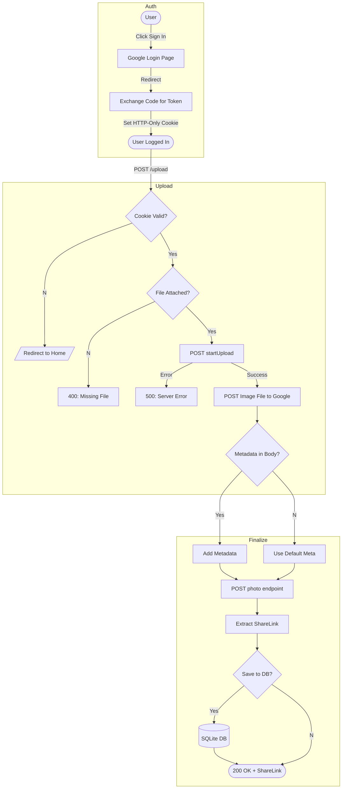

<div align=center>
    
    <br /><br />
    <p>Uploading 360° photos made easy</p>
</div>

# Overview


Upload 360° photos to Google Maps without using Google's app.

The main reason why I created this is because Google Maps isn't a good replacement of the former app. You are only able
to upload 360 photos to specific places on the map. With this project, it is possible to upload them at any coordinates.

If you want to try it out, there are publicly available instances:
| **URL** | **Country** | **Status** | **Hosted By** |
|------------------------------------------------|-------------|------------|---------------|
| [maps.moomoo.me](https://maps.moomoo.me) | 🇬🇧 | Up | @moom0o |


## Quick start

In order to get the Google api keys required for the oauth follow these steps:

### Client ID

1. Create a new project at https://console.cloud.google.com/

2. Head over to the API library and enable
   the <a href="https://console.cloud.google.com/apis/library/streetviewpublish.googleapis.com">Street View Publish
   API</a>

3. Select 'Create Credentials', select 'User Data', enter any app name/email.

4. Enable the 'Street View Publish API' scope. You won't need any sensitive scopes.

5. Select 'Web application' for type, and name it anything.

6. Add http://localhost:7000 to authorized javascript origins. (If you are running on another domain/port, replace
   localhost)

7. Add http://localhost:7000/auth/ to authorized redirect URIs (If you are running on another domain/port, replace
   localhost)

8. You should now copy the Client ID into the config.json file.

### Client Secret

Head to the main credentials screen and click the pencil. (Edit OAuth Client) You will be able to find the Client Secret
and copy that to your config.json.

### Consent Screen

1. Select 'OAuth consent screen', use any name/email

2. Make sure the authorized domain and email is correct, then select 'Save and Continue'.

3. Make sure the Street View Publish API scope is enabled, if not, add it!

4. For test users, add the email address of the account where you want to upload 360 photos.

5. **Make sure to also copy the client ID into index.html**, after '&client_id=' and before '&scope', if needed, change
   the port and domain here as well.

### Config File

There are many options in the config file that might confuse you, so here's a simple guide (I think?) to help you get
through it.

| **Keys**         | **Default values**         | **Usage**                                                                                                                                     |
| ---------------- | -------------------------- | --------------------------------------------------------------------------------------------------------------------------------------------- |
| `https`          | `false` (boolean)          | This is an option whether if you want to enable https or not, this uses boolean values. `false` = http:// and `true` = https://               |
| `host`           | `localhost` (string)       | Your host or domain, if you are hosting on a local machine, set this to `localhost`, if you are hosting this publicly, set it to your domain. |
| `port`           | `7000` (integer) or `null` | Your port, if are running this as a public instance, set this to `null`                                                                       |
| `openWebBrowser` | `true` (boolean)           | This option will open a browser window to PhotoSphereStudio's running instance, set this to `false` if you are running this on a server,      |
| `clientId`       | string                     | Paste your Google OAuth Client ID here, check the previous steps on how to get it.                                                            |
| `clientSecret`   | string                     | Paste your Google OAuth Client Secret ID here, check the previous steps on how to get it.                                                     |

**INFO: Your authorized JavaScript origins and authorized redirect URIs should be the same as the one you have set in
your config file.**

**Scenario 1 - Public Instance**

This example is for those who are hosting a public instance, your https, host and port would look something like this.
Change `maps.moomoo.me` to your domain.

You must use a nginx reverse proxy pointing to localhost:7000 for this to work.

```
{
  "https": true,
  "host": "maps.moomoo.me",
  "port": 7000
}
```

Your **authorized JavaScript origin** would be: `https://maps.moomoo.me`

Your **authorized redirect URIs** would be: `https://maps.moomoo.me/auth/` (don't forget the slash after `auth`)

**Scenario 2 - Private Instance**

This example is for those who are running PhotoSphereStudio on a local machine, your https, host and port would look
something like this.

```
{
    "https": false,
    "host": "localhost",
    "port" 7000
}
```

Your **authorized JavaScript origin** would be: `http://localhost:7000`

Your **authorized redirect URIs** would be: `http://localhost:7000/auth/` (don't forget the slash after `auth`)

## Installation

1. Clone the repository

```bash
git clone https://github.com/moom0o/PhotoSphereStudio.git
```

2. Install the dependencies

```bash
npm install
```

3. Update the `config.json` file in the root directory of the project and fill it with the required information (clientId, clientSecret, etc.)

4. Start the server

```bash
node index.js
```

## Credits
* **Backend & Architecture:** [moom0o](https://github.com/moom0o) - *OAuth flow, API Design, Database, Google Cloud API integration. Client-Side interactions.*
* **UI/UX:** [Win](https://github.com/WinsDominoes) - *Visual design, CSS*

## Support
If you have any questions about how to set this up or about the source code, feel free to create a issue or pull request.
